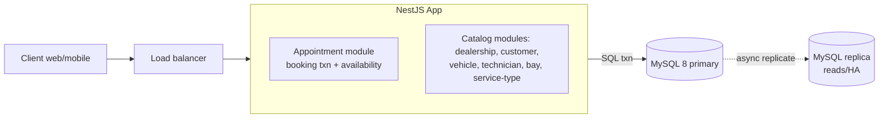

# Unified Service Scheduler — Backend Design

> Design as **hypothesis**: the honest scale estimate below says this is a
> *correctness-under-concurrency* system, not a big-data system. The whole design
> follows from that. If a constraint changes (10× dealers, multi-region), the
> section that changes is called out.

Stack: **NestJS (TypeScript)** + **MySQL 8 (InnoDB)**, single region.

---

## 1. Scale — numbers first, so we don't over-build

Directional BOTEC for a large dealer network:

| Quantity | Estimate | Basis |
|---|---|---|
| Dealerships | ~1,000 | large chain |
| Bays / dealer | ~15 | |
| Technicians / dealer | ~30 | |
| Appointments / dealer / day | ~100 | |
| **Appointments / day (all)** | **~100k** | 1,000 × 100 |
| Avg write QPS | ~1.2/s | 100k / 86,400 |
| **Peak write QPS** | **~15/s** | ~10× burst at open |
| Availability-check reads | ~10× writes → **~150/s peak** | check-heavy flow |
| Appointment row | ~1 KB | |
| **Storage / year** | **~36 GB** | 36.5M rows × 1 KB |

**Conclusion:** peak load is *tens of QPS* and storage grows ~tens of GB/year. A
**single MySQL primary** (with a replica for HA/reads) handles this for years. We
do **not** need sharding, distributed locks, Kafka, or multi-region. The design
challenge is **not throughput — it is never double-booking a resource under
concurrent requests.** Spending complexity there, not on scale, is the whole game.

---

## 2. High-level architecture



- **Stateless NestJS tier** behind a load balancer — scale horizontally if ever
  needed (it won't be, at these numbers; keeps deploys/HA simple).
- **MySQL primary is the single source of truth for the invariant.** The entire
  double-booking constraint lives inside *one* relational DB, so it is enforced by
  a local ACID transaction — no distributed consensus, no Redlock, no cache to
  invalidate. This is the key simplification the scale numbers buy us.
- **Read replica** for availability reads and HA failover (async replication;
  bookings always read+write the primary to stay strongly consistent).
- **No Redis / no outbox.** Availability reads hit the DB directly (~150/s is
  trivial; a cache would add invalidation cost for no throughput need). No
  downstream notification/confirmation is in scope, so there's no event to relay.

---

## 3. Data model (MySQL)

```sql
-- Reference / catalog
dealership(id PK, name, timezone, open_time, close_time, ...)
customer(id PK, name, email, phone, ...)
vehicle(id PK, customer_id FK, vin UNIQUE, make, model, year, ...)

technician(id PK, dealership_id FK, name, active, ...)
service_bay(id PK, dealership_id FK, name, active, ...)
service_type(id PK, code UNIQUE, name, duration_minutes, ...)

-- qualification: which technicians can perform which service types (direct link)
technician_service_type(technician_id FK, service_type_id FK,
                        PRIMARY KEY(technician_id, service_type_id))

-- The confirmed record
appointment(
  id            PK,
  dealership_id FK,
  customer_id   FK,
  vehicle_id    FK,
  service_type_id FK,
  technician_id FK,
  service_bay_id FK,
  start_at      DATETIME,        -- UTC
  end_at        DATETIME,        -- start_at + duration
  status        ENUM('CONFIRMED','CANCELLED','COMPLETED','NO_SHOW'),
  idempotency_key VARCHAR(64) NULL,
  created_at, updated_at,
  UNIQUE KEY uq_idem (idempotency_key)   -- retry-safe booking
)
```

### Enforcing "no overlap" — the reservation-slot table (recommended)

MySQL 8 has **no exclusion constraint** (unlike Postgres GiST). To make
double-booking *structurally impossible* rather than merely checked, discretize
time into fixed **slots** (e.g. 30 min, aligned to a grid) and reserve every slot
a resource occupies:

```sql
resource_reservation(
  resource_type ENUM('TECH','BAY'),
  resource_id   BIGINT,          -- technician_id or service_bay_id
  slot_start    DATETIME,        -- one row per occupied 30-min slot
  appointment_id FK,
  PRIMARY KEY (resource_type, resource_id, slot_start)   -- <== the guard
)
```

A booking that needs slots `[10:00, 10:30, 11:00]` for tech 7 and bay 3 inserts 6
rows. **The composite PK makes a conflicting insert fail with a duplicate-key
error** — the database itself rejects the second concurrent booking. No
application-level check can race it. Service durations are rounded up to the slot
grid (a reasonable constraint for dealerships).

---

## 4. The core flow — availability check + atomic confirm

This is the fragile component; everything else is CRUD. Two concurrent customers
must never both win the same technician/bay/time.

### Read path (availability check — advisory only)
1. Compute candidate slot set from `startAt` + `service_type.duration`.
2. A start time is **available** iff there exists **at least one** qualified
   technician *and* at least one active bay both free for every needed slot.
   - Qualified technicians = techs at the dealership linked to this service_type
     via `technician_service_type`, with **no** reservation on any needed slot.
   - Free bays = active bays at the dealership with no reservation on any slot.
3. Return the set of **available start times** — not specific technician/bay. The
   client never chooses a resource; assignment happens atomically at booking.

### Write path (confirm — the authority)
```
BEGIN;                                   -- InnoDB, REPEATABLE READ
  -- idempotency: if idempotency_key exists -> return existing appt
  -- auto-assign (hotspot-safe):
  --   1) pick top-K qualified technicians by load, then randomize
  --   2) pick top-K free bays by load, then randomize
  --   3) try shuffled candidate pairs; lock candidates with FOR UPDATE SKIP LOCKED
  INSERT appointment(...);               -- status CONFIRMED
  INSERT resource_reservation(TECH, tech_id, slot) for each slot;
  INSERT resource_reservation(BAY,  bay_id,  slot) for each slot;
COMMIT;
-- duplicate-key on any reservation row  -> ROLLBACK -> retry next candidate,
--   or 409 Conflict if none left -> re-run availability.
```

Because the reservation rows and the appointment commit **in one transaction**,
the appointment exists **iff** every slot was free. The DB, not the app, is the
referee. Auto-assignment picks a candidate resource pair *inside* the transaction,
so the client can't hold or race a specific technician/bay. To avoid hot-spotting
on the same "least-loaded" resource under concurrency, candidate choice uses
**top-K + random + SKIP LOCKED** instead of a deterministic first pick.

### Trade-offs of concurrency strategies (solves / worsens / change-when)

| Strategy | Solves | Worsens | Change when |
|---|---|---|---|
| **Slot reservation + unique PK** (recommended) | Double-booking is *structurally* impossible; simple, index-only conflict detection; no range locks | Forces time onto a slot grid; extra rows per booking | Need arbitrary-precision durations → use SELECT…FOR UPDATE range check |
| `SELECT overlapping FOR UPDATE` then insert | Arbitrary durations, no grid | Gap/next-key locking on ranges; more contention; easy to get isolation subtly wrong | Grid is acceptable → prefer slot table |
| Optimistic (check, insert, catch dup) | Cheapest under low contention | Wasted work + retry on conflict | Contention low and grid used — this is what the slot table already does |
| Distributed lock (Redis/Redlock) | Would coordinate across nodes | Adds a SPOF, lock-expiry correctness bugs, needless — one DB already serializes | Never here; only if the invariant left MySQL |

**Why not a distributed lock / queue serializer?** The invariant lives entirely in
one MySQL node, which already provides ACID serialization. Adding Redlock or a
Kafka partition-per-resource would buy coordination we already have, plus new
failure modes. YAGNI — the scale numbers forbid it.

---

## 5. API design

REST/JSON (browser + mobile clients, cacheable reads, simplest contract).

| Method | Path | Purpose |
|---|---|---|
| `GET` | `/dealerships/{id}/availability?serviceTypeId=&date=` | List **available start times** (no resource shown) |
| `POST` | `/appointments` | Book — auto-assigns tech + bay; **idempotent** via `Idempotency-Key` header |
| `GET` | `/appointments/{id}` | Fetch record |
| `PATCH` | `/appointments/{id}` | Cancel / reschedule (frees + re-reserves slots in one txn) |

**Booking request** (`POST /appointments`, header `Idempotency-Key: <uuid>`):
```json
{
  "dealershipId": "...", "vehicleId": "...", "serviceTypeId": "...",
  "startAt": "2026-07-20T14:00:00Z"
}
```
No `technicianId` / `serviceBayId` — the user cannot pick a resource; the server
auto-assigns any qualified technician and any free bay at commit time.
- **201** → the created `Appointment` (customer, vehicle, assigned technician, bay, times).
- **409 Conflict** → the start time just filled up; body includes fresh alternatives.
- **422** → no technician qualified for this service type, or outside hours.

**Idempotency** is essential: a client retry (flaky network, double-tap) must not
create two appointments. The `Idempotency-Key` is stored uniquely on `appointment`;
a retry returns the original 201 instead of racing a second booking.

---

## 6. Failure modes & degradation

| Failure | Effect | Mitigation |
|---|---|---|
| Two concurrent bookings, same resource/slot | Only one may win | DB unique PK on reservation → loser gets 409, re-offers slots |
| Deterministic least-loaded auto-assign | Hotspot on one technician/bay, extra 409 retries | Top-K randomized candidate pool + `FOR UPDATE SKIP LOCKED` + retry next pair |
| Client retry / double-submit | Risk of duplicate appointment | `Idempotency-Key` unique constraint |
| MySQL primary down | Bookings stop (correctness > availability — CP choice) | HA failover to replica (promote); availability reads may serve slightly stale from replica meanwhile |
| App node crash mid-request | Uncommitted txn rolls back | Atomic txn = no partial booking; no orphan reservations |
| Retry storms on recovery | Amplified load | Exponential backoff + jitter on 409/5xx; idempotency makes retries safe |

**Explicit stance:** under a partition/primary loss we favor **consistency over
availability** (reject bookings rather than risk a double-book). Correct for the
Ownership domain — a lost booking is recoverable; a double-booked bay is a customer
standing in the lot with no technician.

---

## 7. NestJS module structure

```
src/
  dealership/     dealership CRUD
  customer/       customer CRUD
  vehicle/        vehicle CRUD
  technician/     technician CRUD + technician↔service_type qualification links
  service-bay/    bay CRUD
  service-type/   service_type CRUD (duration)
  appointment/    AppointmentController + AppointmentService (booking txn),
                  availability query, reservation repo + slot math, auto-assign
  common/         error filter (409/422 contract), logging interceptor, correlation id
```
One module per table; junction tables (`technician_service_type`,
`resource_reservation`) get **no** module of their own — they live with the
aggregate that owns them (technician, appointment respectively). Auth is out of
scope, so there is no auth guard.
- Booking transaction uses a TypeORM/Knex `queryRunner` (single connection,
  `BEGIN…COMMIT`), catching duplicate-key (`ER_DUP_ENTRY`) → retry next candidate
  or 409.
- Auto-assignment is hotspot-safe: pick top-K qualified technicians and top-K free
  bays by load, randomize candidate order, lock selected candidates with
  `FOR UPDATE SKIP LOCKED`, then attempt insert; on conflict, next candidate.

---

## 8. Observability & logging (coverage sweep)

- **Structured logging** (NestJS `Logger` over pino, JSON output): every request
  gets a **correlation id** (generated at the edge, threaded via a logging
  interceptor / AsyncLocalStorage). Log booking attempts, the assigned
  technician/bay, and every 409 conflict with the contended resource + slot — this
  is the Ownership **audit trail** (who booked/assigned what, when). Log levels:
  `info` for booking lifecycle, `warn` for conflicts, `error` for txn failures.
- **Metrics (RED):** booking request rate, 409-conflict rate (contention signal),
  p95 confirm latency, availability-query latency.
- **Alerts:** conflict rate spike (grid too coarse / hot dealership), primary
  replication lag, error-budget burn.

Deferred with reason: `distributed-logging` pipeline (single-region app log volume
is low — stdout → host log agent is enough; revisit at 100×), `distributed-search`
(no free-text search), `sharded-counters` (no high-write counts), `sequencer` (DB
auto-increment/UUID suffices), CDN (no static/media in backend scope).

---

## 9. Additional concerns (later expansion)

- **Replica-lag ghost availability window:** availability read from replica can
  show free while primary commit path returns 409. Later expansion options:
  near-horizon availability from primary, lag-aware read routing, surface
  `freshnessLagMs` in availability response.
- **Fragmentation from mixed durations + arbitrary times:** random booking times
  can create small unusable gaps. Later expansion options: stricter slot
  alignment policy, best-fit placement heuristic, protected windows for long jobs.

---

## 10. Score & weakest dimension

| Dimension | Rating | Note |
|---|---|---|
| Correctness of core invariant | ★★★★★ | DB-enforced, race-proof |
| Right-sized (no over-engineering) | ★★★★★ | single DB, justified by BOTEC |
| API concreteness | ★★★★☆ | shapes + idempotency defined |
| Failure handling | ★★★★☆ | CP stance + atomic txn + backoff |
| Flexibility of time model | ★★★☆☆ | **weakest** — slot grid forces duration rounding |

**Weakest dimension:** the fixed slot grid. It makes concurrency trivially correct
but forces service durations onto slot boundaries. **What would raise it:** switch
the reservation guard to a `SELECT … FOR UPDATE` range-overlap check (arbitrary
durations) *if and when* a service type needs off-grid timing — a local change to
the `appointment` module only, not a redesign. That locality is the sign the
design was reasoned, not memorized.

### Next scale curve (when to evolve)
Watch appointments/day and conflict rate. First things to break if this grew 100×:
(1) availability query cost → add a materialized per-dealer/day free-slot cache (or
introduce Redis then — not now);
(2) single-primary write ceiling → shard by `dealership_id` (bookings never span
dealerships, so it shards cleanly). Neither is needed today.
