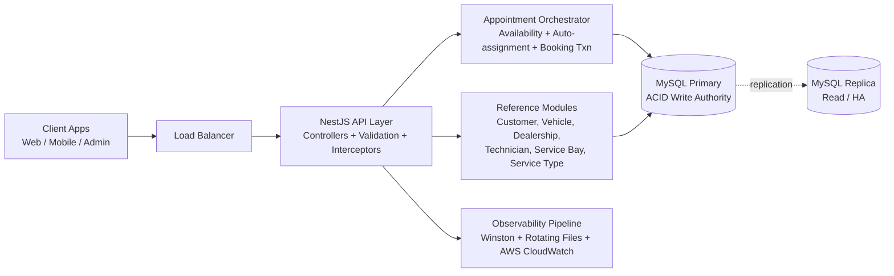

# Service Scheduler System Design

## 1. Architecture Diagram

## 2. Component Roles

- Client Apps: request availability, create appointments, and query appointment details.
- Load Balancer: provides a single entry point and distributes traffic across stateless API instances.
- NestJS API Layer: validates request contracts, enforces API behavior, and routes to domain services.
- Appointment Orchestrator: core business logic for slot validation, resource selection, conflict handling, and transactional booking.
- Reference Modules: manage CRUD and lookup data for all scheduling entities.
- MySQL Primary: source of truth for appointment consistency and overlap protection.
- MySQL Replica: read scaling and failover target.
- Observability Pipeline: captures runtime signals for troubleshooting, SLO tracking, and auditing.

## 3. Data Flow

1. Client calls availability endpoint with dealership, service type, and date.
2. API validates the input (slot alignment, time window, required IDs).
3. Appointment service computes candidate start slots on a fixed 15-minute grid, constrained by dealership opening hours (request times are rounded/aligned to the slot grid inside the open window).
4. Service filters technicians by service-type qualification, then builds candidate technician + bay pairs.
5. Service prioritizes the top 5 least-loaded technician + bay candidates first to maximize near-term slot success.
6. If high request pressure turns those top candidates into hotspots, service continues through the remaining candidate pool until a valid pair is found or capacity is exhausted.
7. Client submits booking request for a selected start time.
8. API opens a database transaction on MySQL primary.
9. Service auto-selects an eligible technician and service bay, inserts appointment + reservations, and commits atomically.
10. On reservation conflict, transaction rolls back and returns conflict (or retries candidate assignment internally).
11. Success response returns confirmed appointment data.
12. Structured logs, metrics, and traces are emitted throughout each request.

## 4. Technology Choices and Justifications

- NestJS (TypeScript): modular architecture and strong DX for maintainable domain boundaries.
- MySQL 8 (InnoDB): ACID transactions and mature indexing needed for strict no-overlap booking guarantees.
- TypeORM (or repository abstraction): consistent data access with transaction-scoped control for booking workflows.
- Docker + Docker Compose: reproducible local and CI environments (app + primary/replica DB).
- OpenAPI/Swagger: explicit API contracts for QA, frontend integration, and faster manual validation.
- Winston logger with daily rotate file transport: structured JSON logs with controlled retention and archival-friendly file layout.
- AWS CloudWatch (design): centralized logs, metrics, dashboards, alarms, and trace visibility within AWS-native operations.

Note: this is a production architecture design target only; it is not implemented in the current codebase yet.

## 5. Observability Strategy 
### Logging

- Use Winston structured JSON logs, write logs to rotating files (for example, daily rotation with retention limits and compressed archives).
- Log booking lifecycle events: availability checked, booking attempted, booking committed, booking conflicted.
- Include domain keys in logs.

### Metrics

- Request metrics: RPS, p95/p99 latency, 4xx/5xx rate per endpoint.
- Domain metrics: booking success rate, conflict rate, retry count, slot utilization by dealership.
- Database metrics: connection pool saturation, transaction duration, replica lag.
- Publish metrics and create dashboards/alarms in AWS CloudWatch.

### Tracing

- Trace each API request through controller -> service -> repository -> DB.
- Annotate booking spans with conflict and retry metadata.
- Use traces to isolate slow queries and contention patterns.
- Use AWS CloudWatch-native tracing integration in production.

### Alerting

- Alert on elevated 5xx error rate, p95 latency breach, conflict spikes, and replica lag threshold.
- Define an SLO for booking confirmation latency and success ratio during business hours.
- Implement alarm routing through AWS CloudWatch alarms in production.

## 6. GenAI-Assisted Design Process

GenAI was used as a design co-pilot, not as an autonomous decision maker.

- Used GenAI to draft alternative architecture options (single DB authority vs distributed locking).
- Used GenAI to pressure-test concurrency invariants and identify race-condition edge cases.
- Used GenAI to refine API shapes and conflict semantics for booking workflows.
- Used GenAI to generate candidate observability KPIs and alert thresholds.
- Human review validated final decisions against project requirements, correctness constraints, and implementation feasibility.

Final ownership of design choices, trade-offs, and scope boundaries remained with the engineer.
